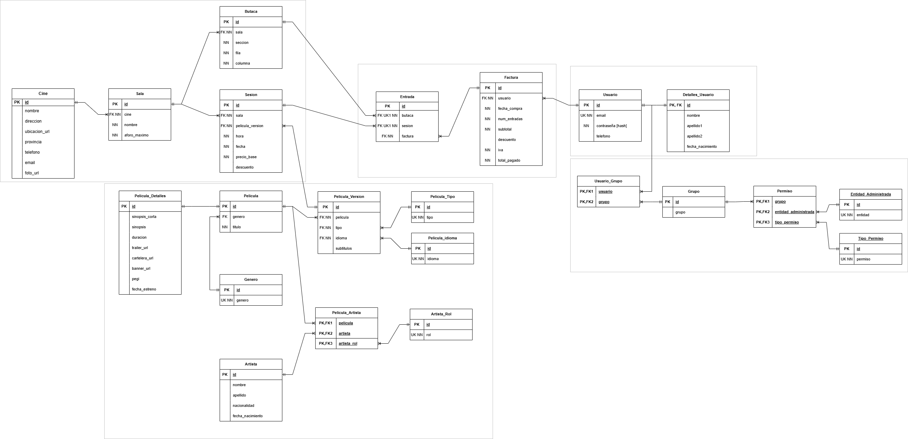

# Diseño BBDD
- [Requisitos Funcionales](https://github.com/juanmiraaaa/ProyectoIntermodular/blob/main/doc/DiagramaBBDD/Diagrama_ER.md#requisitos-funcionales)
- [Diseño Conceptual](https://github.com/juanmiraaaa/ProyectoIntermodular/blob/main/doc/DiagramaBBDD/Diagrama_ER.md#dise%C3%B1o-conceptual)

## Requisitos Funcionales

Cada cine deberá de contener información como el nombre, localización e información de contacto.

Un cine tiene salas, de las cuales guardaremos el número de la sala y el aforo máximo.

Cada sala va a tener una serie de butacas, de las que queremos guardar su ubicación: sector, fila, número de butaca, precio añadido si aplicable.

En cada sala se celebrarán sesiones, de las cuales queremos saber la fecha, hora, preció de la sesión, descuento si aplicable y preció total.

En las sesiones se proyecta la película. Una sesión proyecta una sola película, y una película se proyecta en muchas sesiones.

De película queremos guardar: título, sinopsis, tráiler, duración, clasificación de edad, foto de cartelera, fecha de estreno.

Una película puede ser Version Original Subtitulada o Doblada. Una película puede ser de un tipo o del otro, nunca de los dos a la vez.

Una película puede pertenecer a muchos géneros, y muchos géneros puede tener muchas películas. De género queremos guardar el nombre del mismo.

Artistas queremos guardar: nombre, apellidos, nacionalidad, fecha de nacimiento. NO vamos a diferenciar si son actores, directores, compositores, etc.

Una película tiene un artista que dirige, muchos actores que actuan y en caso de ser Doblada, muchos actores de doblaje. Un actor o director puede participar en más de una película.

Los clientes comprarán una butaca para una sesión. Solo se puede comprar una misma butaca para una sesión en concreto. Es decir, se debe de evitar el overbooking: vender la misma butaca a dos clientes distintos en la misma sesión.

De cliente guardaremos: Email, contraseña encriptada, nombre, apellidos, fecha de nacimiento, edad.

Guardaremos también las formas de pago del cliente. Cada cliente puede guardar varias formas de pago, y estas pueden ser PayPal y mastercard. Una forma de pago puede ser de un tipo o de otro.

## Diseño Conceptual

### Entidades:
- Cine
- Sala
- Butaca
- Sesion
- Pelicula
- Genero
- VOS
- Doblada
- Artista
- Cliente
- FormaDePago
- PayPal
- MasterCard

*Añadida la entidad Entrada*
- Entrada

### Relaciones:
- TIENE entre Cine y Sala
- TIENE entre Sala y Butaca
- CELEBRA entre Sala y Sesion
- PERTENECE entre Pelicula y Genero
- ES entre Pelicula y VOS
- ES entre Pelicula y Doblada
- DIRIGE entre Artista y Pelicula
- ACTUA entre Artista y Pelicula
- DOBLA entre Artista y Doblada
- PROYECTA entre Pelicula y Sesion
- TIENE entre Cliente y FormaDePago
- ES entre FormaDePago y PayPal
- ES entre FormaDePago y MasterCard
- COMPRA entre Sesion, Butaca y Cliente **TERNARIA**

*Añadido la entidad Entrada para resolver la ternaria.*
> COMPRA entre Cliente y Entrada
>
> TIENE entre Entrada y Sesion
>
> TIENE entre Entrada y Butaca

### Participación:
Un cine tiene muchas salas, una sala pertenece a un solo cine (0, N) (1, 1)

Una sala tiene muchas butacas, una butaca pertenece a una sola sala (0, N) (1, 1)

Una pelicula pertenece muchos generos, un genero puede ser de muchas peliculas (0, N) (0, N)

Una pelicula puede ser VOS o Doblada. (Herencia: Especialización - Total Exclusiva)

Un artista puede dirigir muchas peliculas, una pelicula solo puede ser dirigida por un director (0, N) (1, 1)

Un artista puede actuar en muchas peliculas, una pelicula puede tener muchos actores (0, N) (0, N)

Una Pelicula doblada puede ser doblada por muchos artistas, un artista puede doblar muchas peliculas dobladas (0, N) (0, N)

Una pelicula se proyecta en muchas sesiones, una sesion solo proyecta una pelicula (0, N) (1, 1)

Una sala celebra muchas sesiones, una sesion solo es celebrada en una sala (0, N) (1, 1)

Un cliente puede tener muchas FormaDePago, una FormaDePago pertenece a un solo cliente (0, N) (1, 1)

Una FormaDePago puede ser PayPal o MasterCard. (Herencia: Especialización - Total Exclusiva)

**TERNARIA**
Un cliente puede comprar muchas butacas para la misma sesion, una misma butaca puede ser comprada por muchos cliente en muchas sesiones distintas, una sesion puede puede contener compras de muchos clientes y muchas butacas. (0, N) (0, N) (0, N)

*Añadido entidad Entrada*
> Un Cliente puede comprar muchas Entradas, una Entrada solo puede ser comprada por un Cliente (0, N) (1, 1)
>
> Una Entrada tiene una sola Butaca, una Butaca puede pertenecer a muchas Entradas. (1, 1) (0, N)
>
> Una Entrada tiene una sola Sesion, una Sesion puede pertenecer a muchas Entradas. (1, 1) (0, N)

### Cardinalidad:
- Cine y Sala mediante tiene (1, N)
- Sala y Butaca mediante tiene (1, N)
- Pelicula y Genero mediante pertenece (M, N)
- Pelicula y VOS mediante es (Especialidad - Total Exclusiva)
- Pelicula y Doblada mediante es (Especialidad - Total Exclusiva)
- Artista y Pelicula mediante dirige (1: N)
- Artista y Pelicula mediante actua (M, N)
- Artista y Doblada mediante dobla (M, N)
- Pelicula y Sesion mediante proyecta (1, N)
- Sesion y Sala mediante celebra (1, N)
- Cliente y FormaDePago mediante tiene (1, N)
- FormaDePago y PayPal mediante es (Especialidad - Total Exclusiva)
- FormaDePago y MasterCard mediante es (Especialidad - Total Exclusiva)
- Cliente, Sesion y Butaca mediante compra (L, M, N) **TERNARIA**

*Añadida la entidad entrada para eliminar la ternaria*
> Cliente y Entrada mediante compra (1, N)
>
> Entrada y Sesion mediante tiene (1, N)
>
> Entrada y Butaca mediante tiene (1, N)

### Diagrama Entidad-Relacion:

### Diseño Lógico:

Se han tomado distintas decisiones, como incluir información sobre permisos, grupos y entidades administradas en usuario. Ahora los usuarios tipo comercial o administrativos pertenecen a un grupo con una serie de permisos que les permite modificar, leer, borrar o insertar elementos en distintas tablas.

En el tema de películas, la pelicula-versión es en verdad lo que se emite. Una película-versión contiene, a parte de la película que se emite, detalles com el idioma de la emisión, la presencia de subtítulos y detalles de la sala como por ejemplo, si la película es en 3D, etc.

